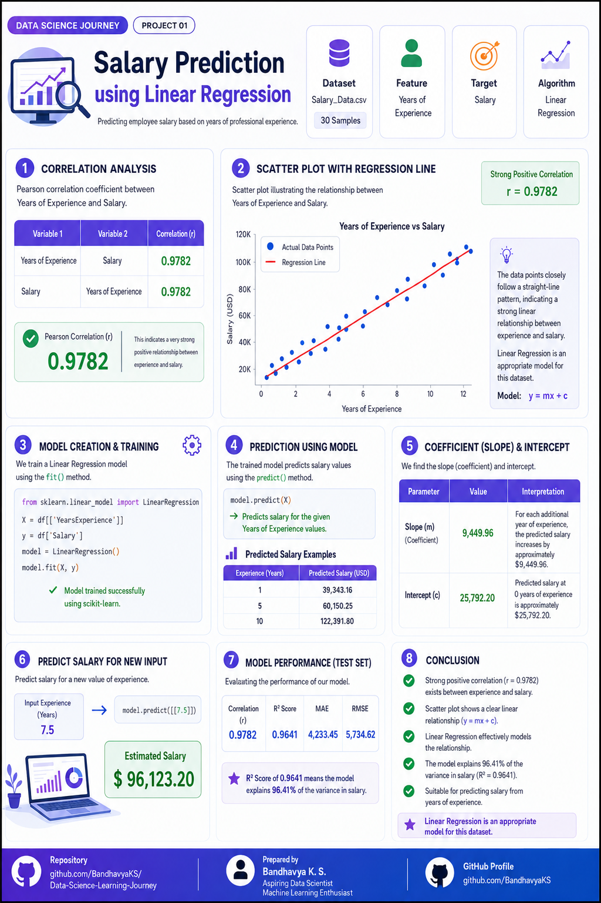

# 📊 Data Science Learning Journey

Welcome to my **Data Science Learning Journey** repository.

This repository documents my hands-on learning in **Data Science, Machine Learning, Data Analysis, and Python** through practical projects. Each project focuses on applying fundamental concepts to solve real-world problems while improving my analytical and programming skills.

As I continue learning, I will regularly add new projects covering data preprocessing, exploratory data analysis (EDA), machine learning, visualization, and model evaluation.

---

# 🚀 Projects

## 📌 Project 01 — Salary Prediction using Linear Regression

This project predicts employee salaries based on **Years of Experience** using the **Linear Regression** algorithm.

### Highlights
- Data Cleaning & Exploration
- Correlation Analysis
- Data Visualization
- Linear Regression Model
- Salary Prediction
- Model Performance Evaluation

### Technologies Used
- Python
- Pandas
- NumPy
- Matplotlib
- Scikit-learn

### Project Preview

### Project Preview

  

---

## 📌 Project 02 — Coming Soon

---

## 📌 Project 03 — Coming Soon

---

⭐ More projects will be added as I continue my Data Science journey.